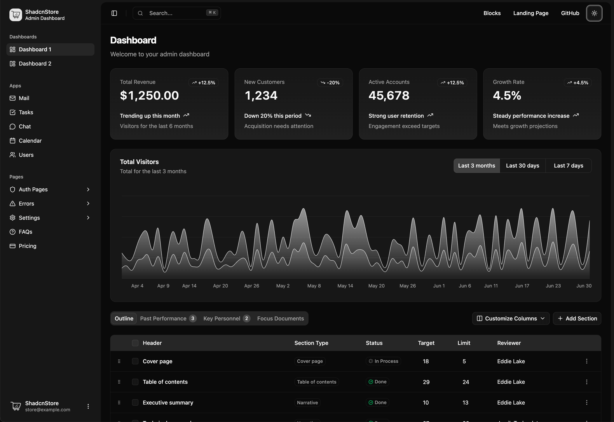

# Qyzen

  

  <strong>Qyzen: Academic Assessment & Classroom Management Platform</strong>
   
  A secure role-based web application for managing classroom assessments, learning materials, scores, student progress, group chats, and real-time academic monitoring.

  
  
  

---

## WebApp Name

Qyzen

## Short Description

Qyzen is a full-stack education technology platform built for administrators, educators, and students. It centralizes online assessments, classroom organization, learning resources, communication, and performance tracking inside one secure web application.

## Overview

Qyzen is organized around three connected portals that reflect how an academic assessment workflow actually moves through a school or training environment.

The **Admin Dashboard** gives administrators a system-wide view of users, roles, permissions, academic terms, academic years, sections, subjects, educators, students, and assessment activity. It supports governance, access control, and academic monitoring.

The **Educator Portal** helps teachers manage the classroom layer. Educators can create sections and subjects, enroll students, prepare assessments, upload or manage quiz questions, share learning materials, review scores, allow retakes, create group chats, and monitor student presence in real time.

The **Student Portal** focuses on the learner experience. Students can view available assessments, take quizzes, track scores and progress, access learning materials, join classroom group chats, and see retake or availability status from their dashboard.

## The Problem

> **Academic assessment workflows are often scattered across spreadsheets, messaging apps, file uploads, manual grading records, and separate classroom tools.**
>
> This creates friction for educators who need to prepare quizzes, assign them to the right class, monitor student activity, review performance, and follow up with learners who need another attempt. Students also lose clarity when assessment schedules, scores, learning materials, and communication are split across different systems.

## The Goal

> **Build a centralized, secure academic platform where administrators, educators, and students can manage assessment workflows with clear role boundaries.**
>
> Qyzen aims to reduce operational clutter by combining classroom setup, quiz delivery, learning materials, score tracking, retake management, notifications, group chats, and real-time monitoring in one application.

## Core Features

| Feature | Description |
| --- | --- |
| **Role-based dashboards** | Shows dashboards for admins, educators, and students with navigation. |
| **Secure access control** | Protects routes, sessions, and records with role based permissions. |
| **Academic management** | Manages users, roles, permissions, terms, and yearly settings centrally. |
| **Classroom setup** | Helps educators organize sections, subjects, enrollments, and student records. |
| **Assessments** | Configures timed assessments with schedules, shuffling, hints, and retakes. |
| **Quiz management** | Supports manual quiz creation and Excel friendly spreadsheet uploads. |
| **Student assessment flow** | Guides quiz attempts, submissions, warnings, scores, and result reviews. |
| **Scores and retakes** | Lets educators review scores while students track retake opportunities. |
| **Real-time monitoring** | Tracks student presence and live classroom activity across dashboards. |

## Development Process

| Plan | UI Structure | Build Application | Secure and Verify |
| --- | --- | --- | --- |
| Scoped role-based academic workflows clearly. | Designed dashboards, tables, dialogs, forms. | Built with Next.js and Supabase. | Hardened authentication and database policies. |

### Plan

The project started with a role-first structure. Admins, educators, and students each needed different workflows, permissions, and dashboard views, so the app was organized around separate route groups and role-aware navigation.

### UI Structure

The interface uses reusable dashboard shells, data tables, modals, form components, charts, and theme-aware UI pieces. This keeps high-volume academic records easier to scan while still supporting complex workflows like quiz uploads, enrollment, score review, and retake controls.

### Build Application

The application was implemented as a full-stack Next.js App Router project. Supabase data loaders and helper assessments shape dashboard analytics, classroom records, assessment data, learning materials, group chats, and notifications before passing them into the UI.

### Secure and Verify

Security hardening focused on keeping sensitive academic records behind the right role boundaries. PostgreSQL row-level security policies, server-side auth checks, validation schemas, and targeted SQL changes protect student scores, educator-owned records, and admin-only operations.

## Design System

### Color System

| Category | Palette |
| --- | --- |
| **Primary** | Blue-based academic interface colors used for dashboards, active states, charts, and primary actions. |
| **Neutral** | Light and dark theme surfaces for cards, tables, sidebars, dialogs, and dashboard panels. |
| **Semantic** | Status colors for success, warnings, destructive actions, pass/fail indicators, notifications, and activity states. |

### Typography

The UI uses a clean dashboard-focused typographic system with compact headings, readable table text, restrained helper copy, and dense layouts suited for repeated academic workflows.

### Interface Components

Qyzen uses shadcn/ui and Radix UI primitives for accessible dialogs, tabs, popovers, dropdown menus, tooltips, tables, forms, sidebars, buttons, cards, and navigation patterns.

## Project Tech Stacks

### Frontend

### Backend and Database

### Application Libraries

### Tooling

